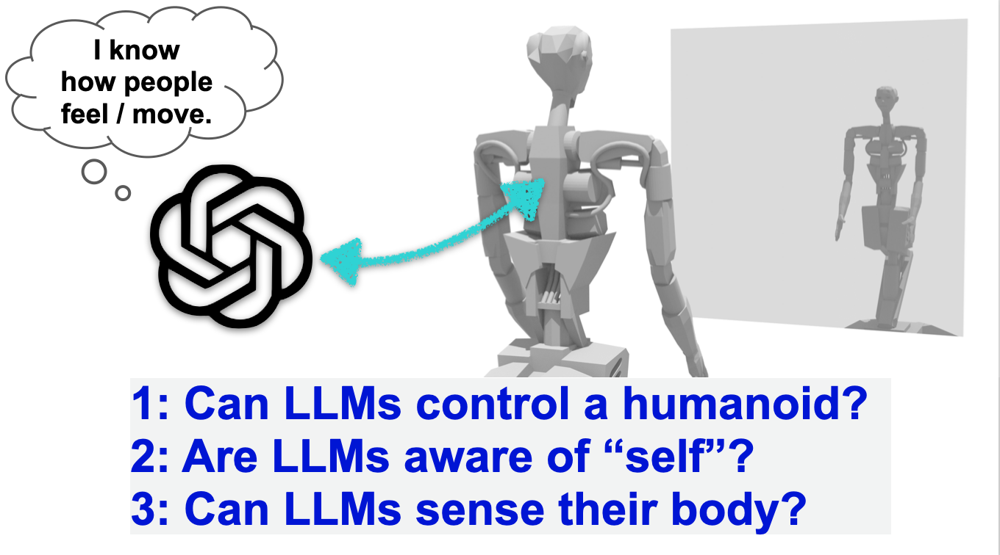
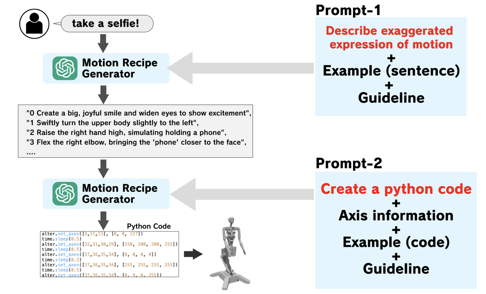

# FastMotionGeneration# From Text to Motion: Grounding GPT-4 in a Humanoid Robot “Alter3”

## Introduction
This repository contains the implementation described in the paper [From Text to Motion: Grounding GPT-4 in a Humanoid Robot “Alter3”](https://arxiv.org/html/2312.06571v1). 



## Method
GPT already understands how humans move and feel.  We use two prompts for this purpose. In `prompt-1`, the input command is described in about ten sentences. In `prompt-2`, each sentence is converted into Python code (motion signals). It is very simple, but it is enough to control a very complex robot with 43 joints!!



## Request
To run this implementation, ensure you have the following dependencies:

```bash
openai == 1.35.13
langchain == 0.2.7
```
***Do NOT forget replace the API with your own. (line53)***

To generate code, use the following command:

```bash
python FastGen.py "Action"
```

Example:
``` bash
python FastGen.py "pretend to be a ghost"
```

Note: You can generate the code, but you will encounter an error if not connected to the Alter3.